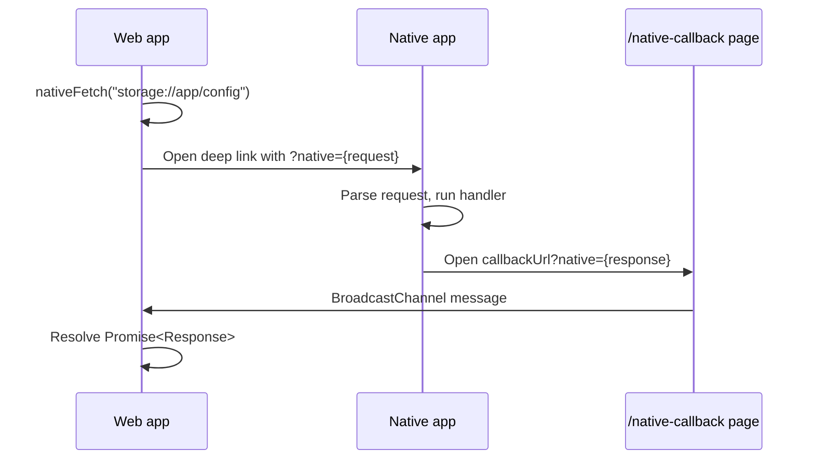

# @aicacia/native-fetch

Bridge HTTP-style requests between a web app and a native application using custom URL schemes (for example `storage://`, `lidp://`).

The browser cannot call custom protocol URLs with `fetch()`. This package defines a small callback protocol: the web page encodes the desired request in a deep link, the native app performs the work, then opens an HTTP(S) callback URL that returns the response to the waiting page.

## Protocol overview



### Step 1 — Web initiates request

The web client calls `nativeFetch(url, init?)`. The library:

1. Generates a random `state` token for correlation.
2. Builds a **native request** object (see [Native request](#native-request)).
3. Appends it as the `native` query parameter on the target custom-scheme URL.
4. Navigates to that URL (custom schemes use `location.href`; HTTP URLs may open in a popup).
5. Listens on a `BroadcastChannel` for the matching response.

Example deep link opened by the browser:

```text
storage://app/config?native=%7B%22url%22%3A%22storage%3A%2F%2Fapp%2Fconfig%22%2C...%7D
```

Decoded `native` query value:

```json
{
  "url": "storage://app/config",
  "headers": { "accept": "application/json" },
  "method": "GET",
  "body": null,
  "state": "a1b2c3d4e5f6...",
  "callbackUrl": "https://my-app.example/native-callback"
}
```

### Step 2 — Native app handles the deep link

Register your app as the handler for the custom scheme (platform-specific). When a URL is opened:

1. Parse the URL and read the `native` query parameter.
2. `JSON.parse` it into a native request object.
3. Execute the equivalent HTTP request locally (any method, headers, and body from the payload).
4. Build a **native response** object (see [Native response](#native-response)).
5. Open the browser at `callbackUrl` with the response in the `native` query parameter:

```text
https://my-app.example/native-callback?native=%7B%22status%22%3A200%2C...%7D
```

The native app must open this URL in the **same browser profile** that initiated the request so the callback page can reach the original tab via `BroadcastChannel`.

### Step 3 — Callback page returns data to the caller

Host a route at `callbackUrl` (default: `{origin}/native-callback`) that calls `handleNativeFetchCallback(searchParams)`. That function:

1. Reads `native` from the query string.
2. Posts `{ type: "native-fetch-response", data: <response> }` on the `BroadcastChannel` named `native-fetch` (configurable).
3. Attempts to close the callback window.

The original `nativeFetch()` call validates `response.state === request.state`, then resolves with a standard `Response`.

### Constants

| Name | Value | Purpose |
|------|-------|---------|
| `NATIVE_FETCH_CHANNEL_NAME` | `"native-fetch"` | `BroadcastChannel` name |
| `NATIVE_FETCH_RESPONSE_EVENT` | `"native-fetch-response"` | Message `type` field |

Both sides can override the channel name via `channelName` in `NativeFetchInit` / `HandleNativeFetchCallbackOptions`.

## Wire format

### Native request

| Field | Type | Description |
|-------|------|-------------|
| `url` | `string` | Absolute URL of the resource (usually the deep link without `native`) |
| `headers` | `Record<string, string>` | Request headers |
| `method` | `string` | HTTP method (default `GET`) |
| `body` | `string \| null` | Request body as UTF-8 text, or `null` |
| `state` | `string` | Opaque correlation token; must be echoed in the response |
| `callbackUrl` | `string` | Absolute HTTPS (or HTTP dev) URL for the callback page |

### Native response

| Field | Type | Description |
|-------|------|-------------|
| `headers` | `Record<string, string>` | Response headers |
| `status` | `number` | HTTP status code |
| `statusText` | `string` | Status text |
| `body` | `string \| null` | Response body as UTF-8 text, or `null` |
| `state` | `string` | Must match the request `state` |

## Implementing a native handler (Rust / Tauri example)

This package does not ship a Rust crate; implement the protocol in your native shell.

```rust
use serde::{Deserialize, Serialize};
use url::Url;

#[derive(Debug, Deserialize)]
struct NativeRequest {
    url: String,
    headers: std::collections::HashMap<String, String>,
    method: String,
    body: Option<String>,
    state: String,
    callback_url: String,
}

#[derive(Debug, Serialize)]
struct NativeResponse {
    headers: std::collections::HashMap<String, String>,
    status: u16,
    status_text: String,
    body: Option<String>,
    state: String,
}

fn handle_deep_link(deep_link: &str) -> Result<(), Box<dyn std::error::Error>> {
    let url = Url::parse(deep_link)?;
    let native_param = url
        .query_pairs()
        .find(|(key, _)| key == "native")
        .map(|(_, value)| value.into_owned())
        .ok_or("missing native query parameter")?;

    let request: NativeRequest = serde_json::from_str(&native_param)?;

    // Run your app logic. Example: return local config JSON.
    let response = NativeResponse {
        headers: [("content-type".into(), "application/json".into())]
            .into_iter()
            .collect(),
        status: 200,
        status_text: "OK".into(),
        body: Some(r#"{"bridgeUrl":"wss://storage.local:9443"}"#.into()),
        state: request.state,
    };

    let mut callback = Url::parse(&request.callback_url)?;
    callback
        .query_pairs_mut()
        .append_pair("native", &serde_json::to_string(&response)?);

    // Open in the system browser (Tauri, wry, etc.)
    open::that(callback.as_str())?;

    Ok(())
}
```

Notes for native implementers:

- Use `#[serde(rename_all = "camelCase")]` on Rust structs if you prefer idiomatic field names (`callbackUrl` ↔ `callback_url`).
- URL-encode the JSON when setting the `native` query parameter (`urlencoding` or your URL library).
- Preserve `state` exactly; the web client ignores mismatched responses.
- On handler failure, still return a native response with `status: 500` and an error message in `body` / `statusText`.
- For server-rendered callback flows (OAuth-style pages that produce a response after user interaction), the web app can call `handleNativeCallbackRequest()` instead of performing the fetch in native code.

## TypeScript / browser usage

Install:

```bash
pnpm add @aicacia/native-fetch
```

### Initiating a request from the web app

```typescript
import { nativeFetch } from "@aicacia/native-fetch";

const response = await nativeFetch("storage://app/config", {
    method: "GET",
    headers: { accept: "application/json" },
    timeout: 30_000,
    callbackUrl: `${window.location.origin}/native-callback`,
});

const config = await response.json();
```

`nativeFetch` requires a browser environment (`window`, `BroadcastChannel`).

### Callback route (SvelteKit example)

```svelte
<script lang="ts">
    import { onMount } from "svelte";
    import { page } from "$app/state";
    import { handleNativeFetchCallback } from "@aicacia/native-fetch";

    onMount(() => {
        handleNativeFetchCallback(page.url.searchParams);
    });
</script>

<p>Returning to app…</p>
```

### Web app as the handler (deep link opens your site)

When the native app opens your web UI with a `native` request (for example client registration), use the server-side helpers:

```typescript
import { handleNativeCallbackRequestUrl } from "@aicacia/native-fetch";

// Tauri deep-link handler, or similar
const callbackUrl = await handleNativeCallbackRequestUrl(deepLinkUrl, async (request) => {
    const data = await loadConfig();
    return new Response(JSON.stringify(data), {
        headers: { "content-type": "application/json" },
    });
});

await openInBrowser(callbackUrl);
```

Or with a parsed request object:

```typescript
import {
    handleNativeCallbackRequest,
    type NativeRequestJSON,
} from "@aicacia/native-fetch";

const callbackUrl = await handleNativeCallbackRequest(
    nativeRequest,
    (request) => new Response(JSON.stringify({ ok: true })),
);
```

### Detecting custom schemes

```typescript
import { isNativeProtocol } from "@aicacia/native-fetch";

if (isNativeProtocol(new URL(endpoint))) {
    await nativeFetch(endpoint, init);
} else {
    await fetch(endpoint, init);
}
```

## Node.js

Functions that touch `window` or `BroadcastChannel` (`nativeFetch`, `handleNativeFetchCallback`, `openUrl`) are browser-only.

These helpers work in Node and are suitable for unit tests or native-side tooling:

- `handleNativeCallbackRequest`
- `handleNativeCallbackRequestUrl`
- `isNativeProtocol`
- `generateState`

## API summary

| Export | Environment | Role |
|--------|-------------|------|
| `nativeFetch` | Browser | Start request, wait for response |
| `handleNativeFetchCallback` | Browser | Callback page → `BroadcastChannel` |
| `handleNativeCallbackRequest` | Any | Build callback URL from request JSON |
| `handleNativeCallbackRequestUrl` | Any | Parse deep link, then build callback URL |
| `isNativeProtocol` | Any | True for non-http(s) schemes |
| `openUrl` | Browser | Navigate or popup; native schemes use `location.href` |
| `generateState` | Any | Random correlation token |

## License

MIT OR Apache-2.0
